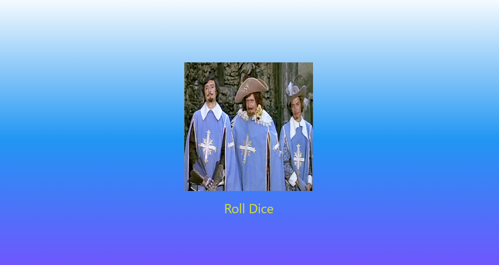

# Лабораторная работа №4-5. Flutter: структура UI и компонентный подход

**ФИО:** Хортюнова София Юрьевна
**Группа:** ИСП-241 
**Дата:**  06.10.2026

## Что изучили

- Как выносить виджеты в отдельные файлы.
- Что такое `StatelessWidget` и `StatefulWidget`.
- Как передавать данные в виджет через конструктор.
- Как подключать картинки через `pubspec.yaml` и папку `assets`.
- Как менять картинку по нажатию кнопки через `setState()` 

## Скриншот финального приложения



## Ссылка на репозиторий
https://github.com/Sofia1-min/Flutter_Lab4.git

## Инструкция по запуску

1. Склонировать репозиторий:
   ```
   git clone <URL_репозитория>
   ```
2. Установить зависимости:
   ```
   flutter pub get
   ```
3. Запустить:
   ```
   flutter run -d chrome
   ```

   ## Ответы на вопросы

**1. Зачем выносить виджеты в отдельные файлы? Что изменится если держать всё в main.dart?**

Чтобы код было легче читать и искать нужный виджет. Если держать всё в `main.dart`, файл разрастается и в нём сложно ориентироваться.

**2. Что такое BuildContext? Почему метод build() принимает его как параметр?**

`BuildContext` — объект с информацией о положении виджета в дереве. Flutter передаёт его автоматически. Метод `build()` принимает его, потому что при построении UI нужно знать, где виджет находится в дереве.

**3. Чем StatelessWidget отличается от StatefulWidget? Приведите пример когда нужен каждый из них.**

`StatelessWidget` не хранит состояние и не меняется. `StatefulWidget` хранит состояние и перерисовывается по `setState()`. Пример `StatelessWidget` — фон с градиентом (`GradientContainer`). Пример `StatefulWidget` — экран с кнопкой и картинкой (`DiceRoller`).

**4. Почему Random() создаётся на уровне файла, а не внутри rollDice()?**

Чтобы генератор случайных чисел создавался один раз, а не при каждом нажатии кнопки. Так эффективнее.